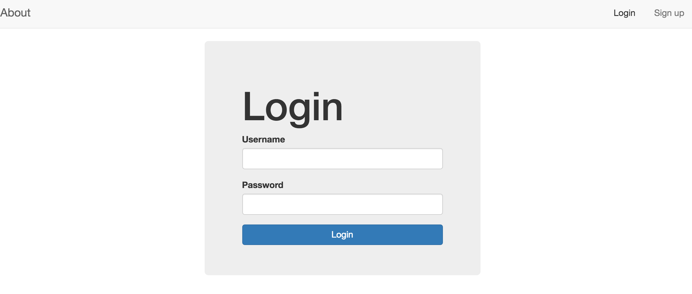

<h2>To Do List </h2>

This site allows you to list everything that you have to do, with the most important tasks at the top of the list, and the least important tasks at the bottom. By keeping such a list, you make sure that your tasks are written down all in one place so you don't forget anything important. 
You can also set goals for the year to make sure you stay on track of all the things you want to acomplish. Writing down your goals will force you to clarify what you want, it will motivate you to take action, it will help you over come resistence, provide a filter for other opportunities, and enable you to see—and celebrate—your progress. 

If you fork this repo, you must run npm install, mongod, and mongo in order for this app to function properly.

<h2>Technologies Used </h2>
Node.js

Express

MongoDB + Mongoose

AngularJS

JSON Web Tokens

BCrypt

Twitter Bootstrap + Custom CSS

Heroku 
 

ERD User >—————- To Do’s 

User Model

username, password, first_name, last_name, email 

Todo Model 

title, summary 

<h2> User Stories </h2>

<h2> Wire Frames </h2>

